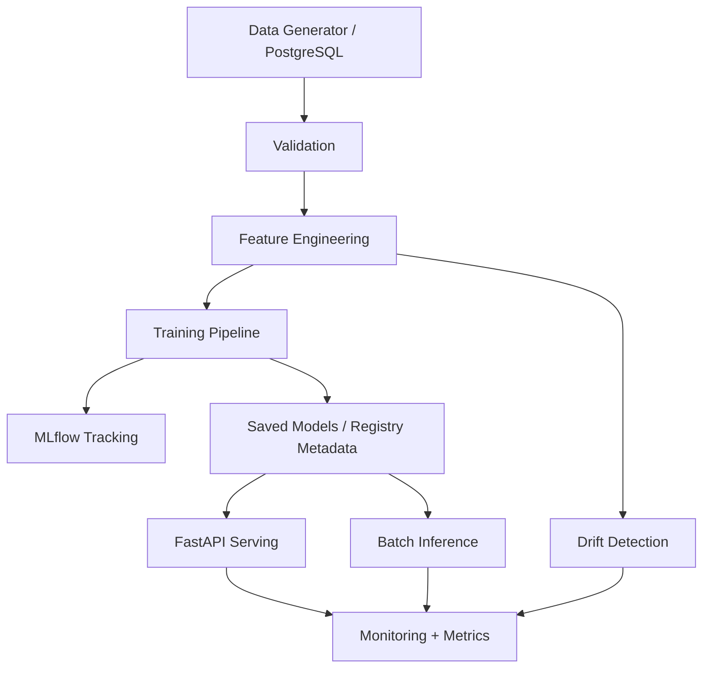

# Enterprise Forecasting & Anomaly Detection MLOps Platform

A production-style machine learning platform for enterprise demand forecasting, KPI anomaly detection, MLflow experiment tracking, FastAPI model serving, batch inference, monitoring, Dockerized services, PostgreSQL integration, and Airflow orchestration.

## 1. Project Title

**Enterprise Forecasting & Anomaly Detection MLOps Platform**

This project simulates an enterprise AI system that predicts daily product demand across products, regions, and sales channels while detecting abnormal business behavior.

## 2. Business Problem

Enterprise teams need to answer questions such as:

- **Demand planning:** How many units will each product-region-channel combination sell?
- **Risk detection:** Are there unexpected demand spikes, drops, abnormal revenue changes, or inventory-driven anomalies?
- **Operational reliability:** Is the model still performing well after deployment?
- **Monitoring:** Are recent inference records drifting away from the training distribution?

## 3. Why This Project Matters

This project demonstrates practical skills expected from ML Engineer, Applied AI Engineer, MLOps Engineer, and enterprise AI roles:

- **Production-style ML:** Code is modular and scriptable, not just notebook-based.
- **Forecasting:** Uses chronological splits and baseline comparison.
- **Anomaly detection:** Uses synthetic labels to evaluate business anomaly detection.
- **MLOps:** Includes MLflow tracking, saved model artifacts, model metadata, serving, monitoring, and orchestration.
- **Backend engineering:** Provides validated FastAPI endpoints for prediction and anomaly detection.

## 4. Architecture Overview



## 5. Tech Stack

- **Core ML:** Python, Pandas, NumPy, scikit-learn, LightGBM
- **Anomaly detection:** Isolation Forest
- **Serving:** FastAPI, Uvicorn, Pydantic
- **Experiment tracking:** MLflow
- **Persistence:** PostgreSQL, SQLAlchemy, CSV artifacts, joblib
- **Orchestration:** Airflow DAG
- **Containerization:** Docker, Docker Compose
- **Testing:** pytest, FastAPI TestClient
- **Visualization:** matplotlib notebook

## 6. Project Structure

```text
.
├── README.md
├── requirements.txt
├── Dockerfile
├── docker-compose.yml
├── .env.example
├── data/
│   ├── raw/
│   ├── processed/
│   └── predictions/
├── notebooks/
│   └── 01_exploratory_analysis.ipynb
├── src/
│   ├── config/
│   ├── data/
│   ├── features/
│   ├── models/
│   ├── inference/
│   ├── monitoring/
│   └── api/
├── airflow/
│   └── dags/
├── tests/
├── reports/
├── models/
└── scripts/
```

## 7. Dataset Description

The dataset is synthetic but designed to resemble a broad global enterprise sales and operations dataset. It is not based on one company, one country, SAP-specific data, UAE-specific data, or Saudi-specific data.

The final project artifacts were generated from a **50,000-row** run. Smaller 5,000-row runs are useful only for optional smoke testing.

Generated columns include:

- **Business keys:** `date`, `product_id`, `product_category`, `region`, `market`, `channel`
- **Drivers:** `unit_price`, `promotion_flag`, `holiday_flag`, `marketing_spend`, `inventory_level`, `competitor_price_index`, `economic_index`
- **Calendar:** `day_of_week`, `month`, `quarter`
- **Targets:** `units_sold`, `revenue`
- **Anomaly metadata:** `anomaly_label`, `anomaly_type`

The final dataset contains:

- **Rows:** 50,000
- **Products:** 40
- **Categories:** Apparel, Automotive, Beauty, Electronics, Grocery, Home, Office Supplies
- **Regions:** Africa, Asia Pacific, Europe, Latin America, Middle East, North America
- **Markets:** 22 global markets across those regions
- **Channels:** Online, Partner, Retail, Wholesale

The generator includes:

- **Weekly seasonality**
- **Monthly seasonality**
- **Product-level demand differences**
- **Regional, market, and channel demand differences**
- **Promotion and holiday effects**
- **Marketing spend effects**
- **Price and competitor index effects**
- **Inventory pressure**
- **Injected anomalies:** demand spikes, demand drops, abnormal revenue changes, and inventory stockouts

## 8. ML Workflow

The end-to-end workflow is:

1. Generate synthetic enterprise sales data.
2. Validate schema and data quality.
3. Build leakage-safe time-series features.
4. Split chronologically:
   - **Train:** earliest 70%
   - **Validation:** next 15%
   - **Test:** latest 15%
5. Train forecasting model and compare against baseline.
6. Train anomaly detection model.
7. Save models and feature columns.
8. Run batch inference.
9. Serve predictions through FastAPI.
10. Generate monitoring and drift reports.

## 9. Forecasting Model

The forecasting target is:

```text
units_sold
```

The main model is:

- **LightGBMRegressor**

Baseline:

- **Previous observed demand / lag-1 demand**

Metrics:

- **MAE**
- **RMSE**
- **MAPE**
- **R²**

Artifacts:

- `models/forecasting_model.joblib`
- `models/feature_columns.json`
- `reports/forecasting_metrics.json`
- MLflow run under `enterprise_forecasting`

## 10. Anomaly Detection Model

The anomaly model is:

- **IsolationForest**

It uses features such as:

- `units_sold`
- `revenue`
- `rolling_mean_7`
- `rolling_std_7`
- `price_ratio_vs_competitor`
- `inventory_level`
- `marketing_spend`

Metrics:

- **Precision**
- **Recall**
- **F1-score**
- **Confusion matrix**

Artifacts:

- `models/anomaly_model.joblib`
- `models/anomaly_feature_columns.json`
- `reports/anomaly_metrics.json`
- MLflow run under `enterprise_anomaly_detection`

## 11. MLOps Features

This repository includes:

- **Scriptable pipelines:** every major step can run from CLI.
- **Experiment tracking:** MLflow logs parameters, metrics, and artifacts.
- **Model version metadata:** JSON metadata is saved with timestamps.
- **Batch inference:** writes scored records to CSV.
- **Online serving:** FastAPI endpoints for demand prediction and anomaly detection.
- **Monitoring:** latency, request counts, anomaly rate, prediction distribution.
- **Drift detection:** compares reference training features against recent inference output.
- **Orchestration:** Airflow DAG represents the full ML workflow.
- **Dockerization:** API, PostgreSQL, MLflow, and Airflow services are defined.

## 12. API Endpoints

Start the API:

```bash
uvicorn src.api.main:app --reload
```

Available endpoints:

- **`GET /`** — service status
- **`GET /health`** — model artifact status
- **`POST /predict`** — single demand prediction
- **`POST /detect-anomaly`** — single anomaly detection
- **`POST /batch-predict`** — list of demand predictions
- **`GET /metrics`** — operational metrics

## 13. Monitoring and Drift Detection

Monitoring modules track:

- **Prediction latency**
- **Number of requests**
- **Prediction distribution**
- **Average prediction value**
- **Anomaly rate**
- **Last prediction timestamp**

Drift detection compares numerical feature statistics:

- **Reference:** `data/processed/train_features.csv`
- **Recent:** `data/predictions/batch_predictions.csv`
- **Output:** `reports/monitoring/drift_report.json`

Run:

```bash
python src/monitoring/generate_monitoring_report.py
```

## 14. How to Run Locally

Create and activate a virtual environment if desired, then install:

```bash
pip install -r requirements.txt
```

Easiest option: run the full pipeline with one command:

```bash
python scripts/run_full_pipeline.py
```

This command:

- **Reuses existing data:** if `data/raw/sales_data.csv` already exists, it does not regenerate it.
- **Generates data only when missing:** if the raw dataset does not exist, it creates a 50,000-row dataset.
- **Refreshes preview:** recreates `data/raw/sales_data_preview.csv`.
- **Runs validation:** validates the raw dataset.
- **Builds features:** writes processed train/validation/test files.
- **Trains models:** retrains forecasting and anomaly models.
- **Runs batch inference:** writes predictions.
- **Generates monitoring:** writes drift and monitoring reports.

Optional step-by-step commands:

Generate or overwrite data manually:

```bash
python src/data/generate_synthetic_data.py --rows 50000
```

Validate manually:

```bash
python src/data/validation.py
```

Build features manually:

```bash
python src/features/build_features.py
```

Train forecasting model manually:

```bash
python src/models/train_forecasting_model.py
```

Train anomaly model manually:

```bash
python src/models/train_anomaly_model.py
```

Run batch inference manually:

```bash
python src/inference/batch_inference.py
```

Generate monitoring report manually:

```bash
python src/monitoring/generate_monitoring_report.py
```

Run full pipeline again:

```bash
python scripts/run_full_pipeline.py
```

Start API:

```bash
uvicorn src.api.main:app --reload
```

## 15. How to Run with Docker

Build and start services:

```bash
docker compose up --build
```

Services:

- **API:** http://localhost:8000
- **MLflow:** http://localhost:5000
- **PostgreSQL:** localhost:5432
- **Airflow:** http://localhost:8080

Airflow login in this local demo compose file:

- **Username:** `admin`
- **Password:** `admin`

Note: the local Python workflow uses file-based MLflow tracking by default so training works even without Docker. You can set `MLFLOW_TRACKING_URI=http://localhost:5000` in `.env` if you want training logs sent to the MLflow service.

## 16. How to Run Tests

```bash
pytest tests/
```

Tests cover:

- **Data generation columns**
- **Validation report**
- **Feature pipeline required features**
- **API health endpoint**
- **Prediction output format**
- **Anomaly output format**

## 17. Example API Requests

Single prediction:

```bash
curl -X POST "http://localhost:8000/predict" ^
  -H "Content-Type: application/json" ^
  -d "{\"date\":\"2024-01-01\",\"product_id\":\"P001\",\"product_category\":\"Electronics\",\"region\":\"Europe\",\"market\":\"Germany\",\"channel\":\"Online\",\"unit_price\":120.0,\"promotion_flag\":1,\"holiday_flag\":0,\"marketing_spend\":1000.0,\"inventory_level\":800.0,\"competitor_price_index\":1.0,\"economic_index\":101.0,\"day_of_week\":0,\"month\":1,\"quarter\":1,\"units_sold\":80,\"revenue\":9600.0,\"anomaly_label\":0,\"anomaly_type\":\"normal\"}"
```

Detect anomaly:

```bash
curl -X POST "http://localhost:8000/detect-anomaly" ^
  -H "Content-Type: application/json" ^
  -d "{\"date\":\"2024-01-01\",\"product_id\":\"P001\",\"product_category\":\"Electronics\",\"region\":\"Europe\",\"market\":\"Germany\",\"channel\":\"Online\",\"unit_price\":120.0,\"promotion_flag\":1,\"holiday_flag\":0,\"marketing_spend\":1000.0,\"inventory_level\":800.0,\"competitor_price_index\":1.0,\"economic_index\":101.0,\"day_of_week\":0,\"month\":1,\"quarter\":1,\"units_sold\":80,\"revenue\":9600.0,\"anomaly_label\":0,\"anomaly_type\":\"normal\"}"
```

Health:

```bash
curl http://localhost:8000/health
```

Metrics:

```bash
curl http://localhost:8000/metrics
```

## 18. Results

The final reported results below come from the generated **50,000-row** run. They are not hardcoded and may change if you regenerate data with a different seed.

Forecasting model metrics:

- **Validation MAE:** 22.2193
- **Validation RMSE:** 37.5199
- **Validation MAPE:** 15.2739%
- **Validation R²:** 0.9110
- **Test MAE:** 23.3366
- **Test RMSE:** 40.7721
- **Test MAPE:** 15.6071%
- **Test R²:** 0.9025

Baseline comparison:

- **Validation baseline R²:** 0.7129
- **Test baseline R²:** 0.6968

Anomaly detection metrics:

- **Validation precision:** 0.0431
- **Validation recall:** 0.0481
- **Validation F1:** 0.0455
- **Test precision:** 0.0625
- **Test recall:** 0.0689
- **Test F1:** 0.0655

Monitoring summary:

- **Prediction volume:** 50,000
- **Predicted anomaly rate:** 4.16%
- **Drift features checked:** 10
- **Drifted features:** `month`

The anomaly detection score is intentionally modest because Isolation Forest is unsupervised and the synthetic anomalies are designed to be meaningful rather than trivially obvious from one column.

## 19. Limitations

- **Synthetic data:** Useful for portfolio demonstration, but not a replacement for real enterprise data.
- **Simple model registry:** Model metadata is JSON-based rather than a full production registry.
- **Basic drift detection:** Uses mean/std comparisons, not advanced statistical tests.
- **Simplified Airflow:** DAG is valid and readable, but production Airflow would need stronger infrastructure configuration.
- **No authentication:** API is local-demo focused and does not include auth.

## 20. Future Improvements

- Add real model registry promotion stages.
- Add Prometheus and Grafana dashboards.
- Add Evidently AI reports for richer drift analysis.
- Add authentication and API rate limiting.
- Add CI/CD pipeline.
- Add feature store integration.
- Add model retraining triggers based on drift or error thresholds.
- Add more advanced forecasting models and hierarchical reconciliation.

## 21. CV Bullet Points

- Built a production-style enterprise forecasting and anomaly detection platform using Python, FastAPI, Airflow, MLflow, Docker, and PostgreSQL to automate data ingestion, feature engineering, model training, batch inference, and monitoring.
- Trained LightGBM forecasting models and Isolation Forest anomaly detection models with chronological validation, baseline comparison, MLflow experiment tracking, and evaluation using MAE, RMSE, MAPE, R², precision, recall, and F1-score.
- Deployed model-serving APIs with FastAPI and added monitoring for latency, anomaly rate, prediction distribution, and feature drift to simulate reliable enterprise ML operations.

## CV Summary

This project is designed to support the CV statement:

> Built a production-style forecasting and anomaly detection platform using Airflow, MLflow, FastAPI, Docker, PostgreSQL, and LightGBM/Isolation Forest, automating ingestion, feature engineering, model training, model artifact management, batch inference, API serving, and monitoring for drift, latency, and prediction error.

## Interview Explanation Guide

When explaining this project, describe it as:

- **Business-first:** It solves demand planning and abnormal KPI detection.
- **ML-engineered:** It uses scripts, modules, tests, and CLI workflows rather than relying on notebooks.
- **MLOps-aware:** It tracks experiments, saves artifacts, serves predictions, and monitors runtime behavior.
- **Enterprise-relevant:** It mirrors the kind of platform used in business software environments where forecasting, monitoring, and reliability matter.
